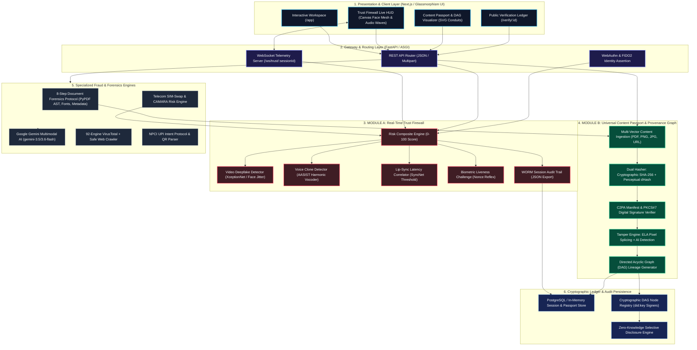

# TRUTHSCAN 360
### Explainable Digital Trust, Real-Time Firewall & Content Provenance Platform
> **Detect • Protect • Verify • Trace • Secure • Build Trust**

[](https://truthscan-eta.vercel.app/)
[](https://github.com/UNKNOWN13546/TRUTHSCAN)
[](https://github.com/UNKNOWN13546/TRUTHSCAN)

🌐 **Live Production Deployment:** [https://truthscan-eta.vercel.app/](https://truthscan-eta.vercel.app/)  
📂 **Source Code Repository:** [https://github.com/UNKNOWN13546/TRUTHSCAN](https://github.com/UNKNOWN13546/TRUTHSCAN)

---

## 📌 Executive Overview

**TRUTHSCAN 360** is an enterprise-grade digital trust, media forensics, and real-time cognitive safety platform. Instead of giving users opaque, binary "real" or "fake" labels, TRUTHSCAN performs multi-vector forensic audits, exposes explainable evidence, highlights exact manipulated phrases or pixel boundaries, and provides cryptographic provenance.

The platform bridges real-time behavioral streams with immutable content lineage:
1. **10 Specialized Modalities:** Phishing text, tampered payment screenshots, malicious URLs, UPI payment QR traps, viral claim debunking, 8-step PDF document forensics, institutional exam seals, telecom SIM-swap detection, deepfake image forensics, and unified multi-vector fraud case orchestration.
2. **MODULE A — Real-Time Trust Firewall:** Live trust verification for video calls, remote proctored exams, interviews, and financial transactions with sub-30ms latency, optical face-swap detection, AASIST voice clone detection, lip-sync audio-visual desync alerts, WebAuthn/FIDO2 passkey verification, and interactive liveness challenges.
3. **MODULE B — Universal Content Passport + Provenance Graph:** Cryptographic SHA-256 + perceptual `dHash` fingerprinting, C2PA Content Credentials auditing, Error Level Analysis (ELA) tamper detection, and an interactive Directed Acyclic Graph (DAG) tracing content origin, revisions, cryptographic signatures, distribution spread, and ledger verification.

---

## 🏛️ Comprehensive System Architecture



---

## 🔍 How Each Layer Works in Detail

### 1. Presentation & Client Layer
- **Live Video & Telemetry HUD:** Uses an HTML5 canvas overlay to render real-time facial landmark nodes, corner bounding brackets, biometric scanning lasers, and a responsive audio spectrogram.
- **Interactive SVG DAG Visualizer:** Renders the 6-stage provenance lineage with cybernetic laser conduit animations (`laser-conduit-cyan`, `laser-conduit-emerald`) and clickable node inspection cards.
- **Glassmorphism Design System:** Built with Tailwind CSS, Lucide icons, dark-mode radial lighting, and micro-animations for zero UI stutter.

### 2. Module A — Real-Time Trust Firewall
Operates in closed-loop cycles during live video calls, interviews, proctored exams, or financial transactions:
1. **Telemetry Streaming:** The client captures media frames and audio buffers, streaming them over `WebSocket /ws/trust/{sessionId}` (or low-latency REST fallback).
2. **Deepfake Video Analysis:** Measures face-boundary jitter, high-frequency neural artifacts, and eye saccade patterns.
3. **Voice Clone & Lip-Sync:** AASIST spectral harmonic inspection detects synthetic text-to-speech vocoders. SyncNet cross-correlation flags lip-motion/audio desync exceeding $100\text{ms}$.
4. **Passkey & SIM-Swap Assertion:** FIDO2 WebAuthn assertions grant trust bonuses; recent carrier IMSI modifications trigger automated risk penalties.
5. **Composite Scoring:** Evaluates a weighted $0 - 100$ score with explainability:
   - 🟢 **GREEN ($\ge 80$):** `ALLOW_SESSION` — Verified authentic, optimal biometric micro-tremors.
   - 🟡 **YELLOW ($50 - 79$):** `WARN_AND_REVERIFY` — Mild latency anomaly or unverified device attestation.
   - 🔴 **RED ($< 50$):** `BLOCK_AND_ISOLATE` — Critical synthetic face-swap or voice clone detected.
6. **Liveness Challenge Engine:** Sends randomized biometric nonces (*e.g., "Blink twice and turn head right"*) with timeout verification.
7. **Tamper-Evident WORM Audit Log:** Appends every event chronologically for instant JSON audit export.

### 3. Module B — Universal Content Passport & Provenance Graph
Verifies and traces documents, academic certificates, exam papers, and media assets:
1. **Multi-Vector Ingestion:** Ingests raw PDFs, images, URLs, or text payloads.
2. **Dual-Hash Fingerprinting:**
   - **SHA-256 Digest:** Provides bit-exact cryptographic integrity validation.
   - **Perceptual dHash:** Gradient difference hashing ($8 \times 8$ resized grayscale matrix) tracks visual identity across re-encodings, resizing, and compressions.
3. **C2PA & Digital Signatures:** Verifies PKCS#7 digital signatures, X.509 certificate chains, and C2PA Content Credentials manifests.
4. **Tamper Forensics (ELA & AI):** Error Level Analysis identifies spliced pixel regions, resaved JPEG compression blocks, and AI generator footprints (`containsAiGeneratedContent: Yes`).
5. **Directed Acyclic Graph (DAG) Generation:** Constructs a connected 6-node provenance pipeline:
   $$\text{Origin Authority} \longrightarrow \text{Author of Record} \longrightarrow \text{Master Asset} \longrightarrow \text{C2PA Seal} \longrightarrow \text{Transit Platform} \longrightarrow \text{TruthScan Ledger}$$
6. **Public Ledger Verification:** Anyone can query any passport by ID (e.g. `CP-A7F29`) or SHA-256 hash to view the cryptographic proof without accessing sensitive document contents.

### 4. The 8-Step Forensic Document Protocol
When official receipts, degrees, or PDFs are uploaded:
1. **Step 1 - Content Inspection:** Typographical anomalies, split words, unnatural math/date mismatches.
2. **Step 2 - Metadata Extraction:** Producer classification (`Canva` = human design, `FPDF`/`ReportLab` = automated billing script, `iLovePDF` = post-generation editor).
3. **Step 3 - Font Hierarchy:** Standard 14 PostScript fonts vs. embedded CID Type 0 subsets.
4. **Step 4 - Image Forensics:** Real text selectable layers vs. flattened raster scans.
5. **Step 5 - Timestamp Cross-Reference:** Creation date vs. printed document datelines.
6. **Step 6 - Machine vs. Human Fingerprints:** Template repetition and synthetic metadata flags.
7. **Step 7 - Institutional Cross-Check:** Registry domain matching and student roll verification.
8. **Step 8 - Verifiable Claims:** Plausibility audit of technical or academic assertions.

---

## 🛠️ Technology Stack

| Layer | Technologies |
| :--- | :--- |
| **Frontend Framework** | HTML5, Tailwind CSS, Three.js (Magic Rings Canvas), Lucide Icons, Vanilla ES6+ |
| **Backend & Routing** | Python 3.12, FastAPI, Uvicorn (ASGI), WebSockets (`websockets`) |
| **AI Reasoning Core** | Google GenAI SDK (`google-genai`), Gemini 3.5 / 3.6 Flash |
| **Computer Vision & Forensics**| Pillow (PIL), NumPy, PyPDF (AST Stream Parsing), Custom ELA Engine |
| **Cryptographic Primitives** | Ed25519 Signatures, SHA-256, Perceptual dHash, C2PA Manifests, WebAuthn/FIDO2 |
| **Deployment & Hosting** | Vercel (Edge Frontend), Python ASGI Server (Local / Cloud Docker) |

---

## 🚀 Quickstart & Setup Guide

### 1. Clone Repository
```bash
git clone https://github.com/UNKNOWN13546/TRUTHSCAN.git
cd TRUTHSCAN
```

### 2. Configure Environment Variables
Create a `.env` file in the root or `backend/` directory:
```env
GEMINI_API_KEY="your-google-gemini-api-key"
VIRUSTOTAL_API_KEY="your-virustotal-api-key"  # Optional
```

### 3. Install Dependencies
```bash
pip install -r backend/requirements.txt
```

### 4. Run Integration Tests
```bash
python backend/tests/test_modules_ab.py
```
*(Validates Trust Firewall session lifecycle, attack simulations, Content Passport generation, and DAG provenance graph).*

### 5. Launch the Application
```bash
cd backend
python -m uvicorn app.main:app --host 127.0.0.1 --port 8000
```
Open your browser:
- **Web App Workspace:** `http://127.0.0.1:8000/app`
- **Trust Firewall HUD:** `http://127.0.0.1:8000/app` $\rightarrow$ Click **Trust Firewall** tab
- **Content Passport & DAG:** `http://127.0.0.1:8000/app` $\rightarrow$ Click **Content Passport & Graph** tab
- **Live Vercel Deployment:** [https://truthscan-eta.vercel.app/](https://truthscan-eta.vercel.app/)

---

## 👥 Hackathon Details & Credits
- **Project:** TRUTHSCAN 360
- **Track:** Track 2 — Trust in a Synthetic World
- **Team:** DUOBYTE
- **Team Members:** AYUSH C S, HAIMA KRISHNA
- **Live URL:** [https://truthscan-eta.vercel.app/](https://truthscan-eta.vercel.app/)
- **Repository:** [https://github.com/UNKNOWN13546/TRUTHSCAN](https://github.com/UNKNOWN13546/TRUTHSCAN)
